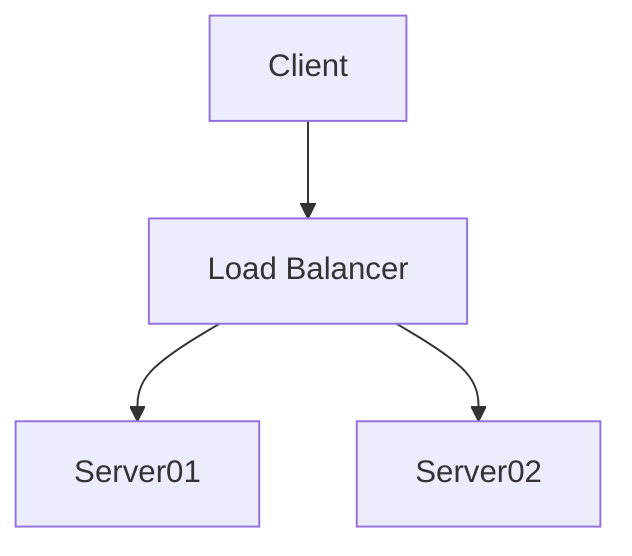

# Pandoc Filter for Obsidian

[![Contributors][contributors-shield]][contributors-url]
[![Forks][forks-shield]][forks-url]
[![Stargazers][stars-shield]][stars-url]
[![Issues][issues-shield]][issues-url]
[![MIT License][license-shield]][license-url]
[![LinkedIn][linkedin-shield]][linkedin-url]


## Installation & Setup

> **Note:** This project uses [conda](https://docs.conda.io/en/latest/) to manage the python environment. If you don't want to use conda, you can install the dependencies manually.
> Also you need to have [pandoc](https://pandoc.org/) and [python](https://python.org) installed.

1. Clone the repo
    ```powershell
    git clone https://github.com/bananensplit/obsidian-pandoc-converter.git
    ```
2. Create a conda environment
    ```powershell
    cd obsidian-pandoc-converter
    conda env create -n pandoc-filter -f environment.yml
    ```
3. Create a `.env` file
    ```powershell
    copy .env.example .env
    ```
4. Edit the `.env` file to your needs (see [Files](#files))


## Usage

> **Note:** This project uses [conda](https://docs.conda.io/en/latest/) to manage the python environment. If you don't want to use conda, you can install the dependencies manually.
> Also you need to have [pandoc](https://pandoc.org/) and [python](https://python.org) installed.

1. Activate the conda environment
    ```powershell
    conda activate pandoc-filter
    ```
2. Run the pandoc command
    ```powershell
    conda activate pandoc-filter
    pandoc .\default.yml '<YOUR MARKDOWN FILE>.md' `
        --resource-path '<PATH TO ATTACHMENTS>' `
        --filter .\filters.py `
        --template ".\template.latex" `
        -s -o '<YOUR OUTPUT FILE>.pdf'
    ```

* `YOUR MARKDOWN FILE` is the markdown file that shall be converted to latex.
* `PATH TO ATTACHMENTS` is the path to the folder where the attachments are stored (this could be the Obsidian Attachements folder).
* `YOUR OUTPUT FILE` is the name of the output file.


## Files
* `filters.py`
    The filter that shall be passed to pandoc.
* `default.yml`
    This file defines additional metadata that is passed to pandoc.
* `template.latex`
    This file defines the template that is used to render the latex file.
* `.env.example`
    This file is a template for the `.env` file. Copy this file to `.env` and edit it to your needs:
    * `RESOURCE_PATH` is the path to the folder where the attachments are stored (this could be the Obsidian Attachements folder).
    * `LOG_FILE` is the path to the log file.
    * All other variables disable or enable the [features](#feature-description) that this filter implements.

* All the icons are from [lucide.dev](https://lucide.dev/)


## Feature description
### Converting Callouts
**Method**: `filters.py -> convert_callouts`
* Converts Obsidian callouts to a format that looks like a callout in latex.
* Also renders the content -> you can put images, boldtext and more callouts inside an exisitng callout.
* Can handle callouts with only title and callouts with title and content.

```markdown
> [!todo] This is the title of an callout
```

```markdown
> [!todo] This is the title of an callout
> Here is some more content
> And also an image 
```

### Convert svgs to pngs
**Method**: `filters.py -> convert_svg_to_png`
* Converts svg images to pngs.
* The pngs are saved in the same folder as the svg.
* The pngs are named like the svg but with the extension png.

```markdown

```
will be converted to
```markdown

```

### Convert mermaid diagrams to pngs
**Method**: `filters.py -> convert_mermaid_to_png`
* Converts mermaid diagrams to pngs.
* The pngs are saved in the `RESOURCE_PATH` folder.
* The pngs are named by the following scheme: `mermaid-<hash of code>.png`
* The pngs are not deleted after the conversion. You have to delete them manually.

```markdown

will be converted to
```markdown

```

### Make Linebreaks
**Method**: `filters.py -> make_linebreaks`
* Converts **every** linebreak (not in a Code Block) in the markdown-file to a linebreak in Latex.

### Make Pagebreaks
**Method**: `filters.py -> make_pagebreaks`
* Makes inversting pagebreaks in the Latex-File possible.

```markdown
Some text
Some more text
<div style="page-break-after: always;"></div> <-- This will be converted to a pagebreak
Even more text
```

### Resize images
**Method**: `filters.py -> resize_images`
* Resizes images to a given width.
* Uses the given Obsidian image syntax to resize the image.
* Also supports resizing mermaid diagrams.

```markdown

```
The image will be resized to a width of 500px.

```markdown

The mermaid diagram will be resized to a width of 500px.


## Find a bug? Have an idea?

If you find a bug in the source code or a mistake in the documentation, you can help me by submitting an issue in the [Issuetracker][issues-url]. Even better you can submit a Pull Request with a fix.

Furthermore if you have an idea for a new feature, feel free to submit an issue with a proposal for your new feature. Please add as much detail as possible to the issue description. This will help me to understand your idea and to discuss it with you.

**Thanks for making this project better!**

## Contact

Jeremiasz Zrolka - jeremiasz.zrolka@gmail.com

-   Twitter: [@jeremiasz_z][twitter-url]
-   Instagram: [@jeremiasz_z][instagram-url]
-   LinkedIn: [jeremiasz-zrolka][linkedin-url]

<!-- MARKDOWN LINKS & IMAGES -->

[repo]: https://github.com/bananensplit/obsidian-pandoc-converter
[contributors-shield]: https://img.shields.io/github/contributors/bananensplit/obsidian-pandoc-converter.svg
[contributors-url]: https://github.com/bananensplit/obsidian-pandoc-converter/graphs/contributors
[forks-shield]: https://img.shields.io/github/forks/bananensplit/obsidian-pandoc-converter.svg
[forks-url]: https://github.com/bananensplit/obsidian-pandoc-converter/network/members
[stars-shield]: https://img.shields.io/github/stars/bananensplit/obsidian-pandoc-converter.svg
[stars-url]: https://github.com/bananensplit/obsidian-pandoc-converter/stargazers
[issues-shield]: https://img.shields.io/github/issues/bananensplit/obsidian-pandoc-converter.svg
[issues-url]: https://github.com/bananensplit/obsidian-pandoc-converter/issues
[license-shield]: https://img.shields.io/github/license/bananensplit/obsidian-pandoc-converter.svg
[license-url]: https://github.com/bananensplit/obsidian-pandoc-converter/blob/master/LICENSE.md
[linkedin-shield]: https://img.shields.io/badge/-LinkedIn-black.svg?logo=linkedin&colorB=555
[linkedin-url]: https://www.linkedin.com/in/jeremiasz-zrolka-78431021b
[twitter-url]: https://twitter.com/jeremiasz_z
[instagram-url]: https://instagram.com/jeremiasz_z
[docker-install-url]: https://docs.docker.com/get-docker/
[python-url]: https://www.python.org/downloads/release/python-3100/
[virtualenv-url]: https://virtualenv.pypa.io/en/latest/installation.html
[openai-url]: https://openai.com/
[chatgpt-url]: https://openai.com/blog/chatgpt
[bing-chat-url]: https://www.bing.com/new
[whisper-url]: https://openai.com/research/whisper
[whisper-github-url]: https://github.com/openai/whisper
[whisper-github-models-url]: https://github.com/openai/whisper#available-models-and-languages