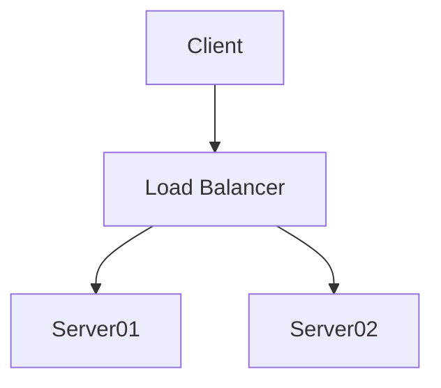

# Files
* `filters.py`
    the filter that shall be passed to pandoc
* `default.yml`
    this file defines additional metadata that is passed to pandoc
* `template.latex`
    this file defines the template that is used to render the latex file
* All the icons are from [lucide.dev](https://lucide.dev/)


# Setup
```powershell
conda env create -n pandoc-filter -f environment.yml
conda activate pandoc-filter
pandoc .\default.yml '<YOUR MARKDOWN FILE>.md' `
    --resource-path '<PATH TO ATTACHMENTS>' `
    --filter .\filters.py `
    --template ".\template.latex" `
    -s -o '<YOUR OUTPUT FILE>.pdf'
```

* `YOUR MARKDOWN FILE` is the markdown file that shall be converted to latex.
* `PATH TO ATTACHMENTS` is the path to the folder where the attachments are stored (this could be the Obsidian Attachements folder).
* `YOUR OUTPUT FILE` is the name of the output file.


# Feature description (13.04.2023)
## Converting Callouts
**Method**: `filters.py -> convert_callouts`
* Converts Obsidian callouts to a format that looks like a callout in latex.
* Also renders the content -> you can put images, boldtext and more callouts inside an exisitng callout.
* Can handle callouts with only title and callouts with title and content.


```markdown
> [!todo] This is the title of an callout
```

```markdown
> [!todo] This is the title of an callout
> Here is some more content
> And also an image 
```


## Convert svgs to pngs
**Method**: `filters.py -> convert_svg_to_png`
* Converts svg images to pngs.
* The pngs are saved in the same folder as the svg.
* The pngs are named like the svg but with the extension png.


```markdown

```
will be converted to
```markdown

```


## Convert mermaid diagrams to pngs
**Method**: `filters.py -> convert_mermaid_to_png`
* Converts mermaid diagrams to pngs.
* The pngs are saved in the `RESOURCE_PATH` folder.
* The pngs are named by the following scheme: `mermaid-<hash of code>.png`
* The pngs are not deleted after the conversion. You have to delete them manually.

```markdown

will be converted to
```markdown

```


## Make Linebreaks
**Method**: `filters.py -> make_linebreaks`
* Converts **every** linebreak (not in a Code Block) in the markdown-file to a linebreak in Latex.


## Make Pagebreaks
**Method**: `filters.py -> make_pagebreaks`
* Makes inversting pagebreaks in the Latex-File possible.

```markdown
Some text
Some more text
<div style="page-break-after: always;"></div> <-- This will be converted to a pagebreak
Even more text
```


## Resize images
**Method**: `filters.py -> resize_images`
* Resizes images to a given width.
* Uses the given Obsidian image syntax to resize the image.
* Also supports resizing mermaid diagrams.

```markdown

```
The image will be resized to a width of 500px.

```markdown

The mermaid diagram will be resized to a width of 500px.